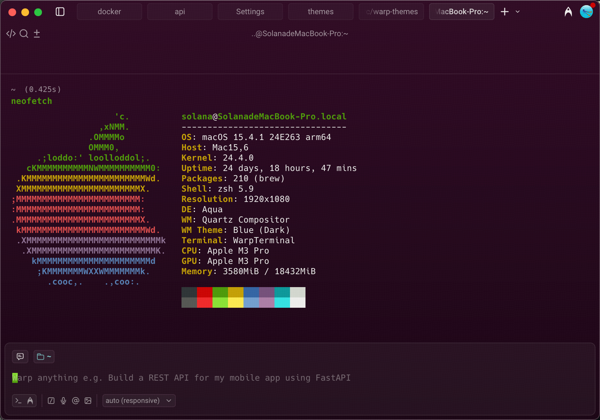

# Warp Themes

A collection of beautiful color themes for [Warp Terminal](https://www.warp.dev/).

## Available Themes

### [Fancy Ubuntu](themes/fancy-ubuntu.yaml)

Ubuntu theme with beautiful purple-to-darker gradients and vibrant green accents.



### [Ubuntu](themes/ubuntu.yaml)

A classic Ubuntu-inspired theme with warm purple background and vibrant accent colors.


### [Gruvbox Dark](themes/gruvbox-dark.yaml)

A retro groove color scheme with warm, earthy tones and comfortable contrast.


### [Gruvbox Light](themes/gruvbox-light.yaml)

Gruvbox light variant with warm cream background, perfect for daytime coding.


### [Nord](themes/nord.yaml)

An arctic, north-bluish color palette with calm and serene aesthetics.


### [Nord Light](themes/nord-light.yaml)

Nord light variant with soft bluish-white background for a clean, minimal look.


### [Everforest Dark Hard](themes/everforest-dark-hard.yaml)

A green-based color scheme designed to be warm and comfortable for your eyes.


---

## Installation

Copy the theme file(s) to your Warp themes directory:

```bash
cp themes/*.yaml ~/.warp/themes/
```

Then select the theme in Warp: `Settings` → `Appearance` → `Theme`

## Custom Theme Guide

For more information on creating custom themes, see the [Warp documentation](https://docs.warp.dev/terminal/appearance/custom-themes#create-your-custom-theme-manually).
