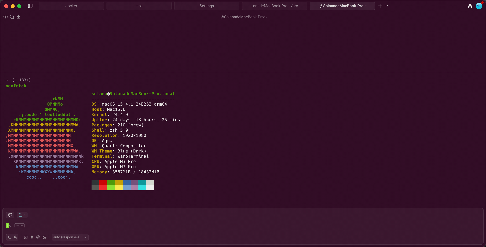
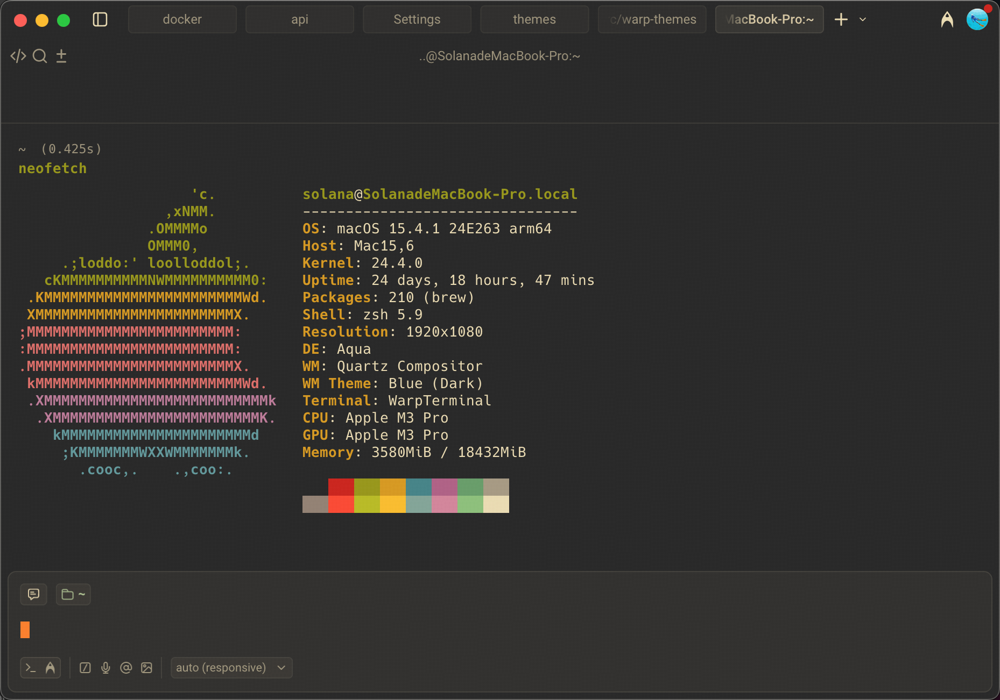
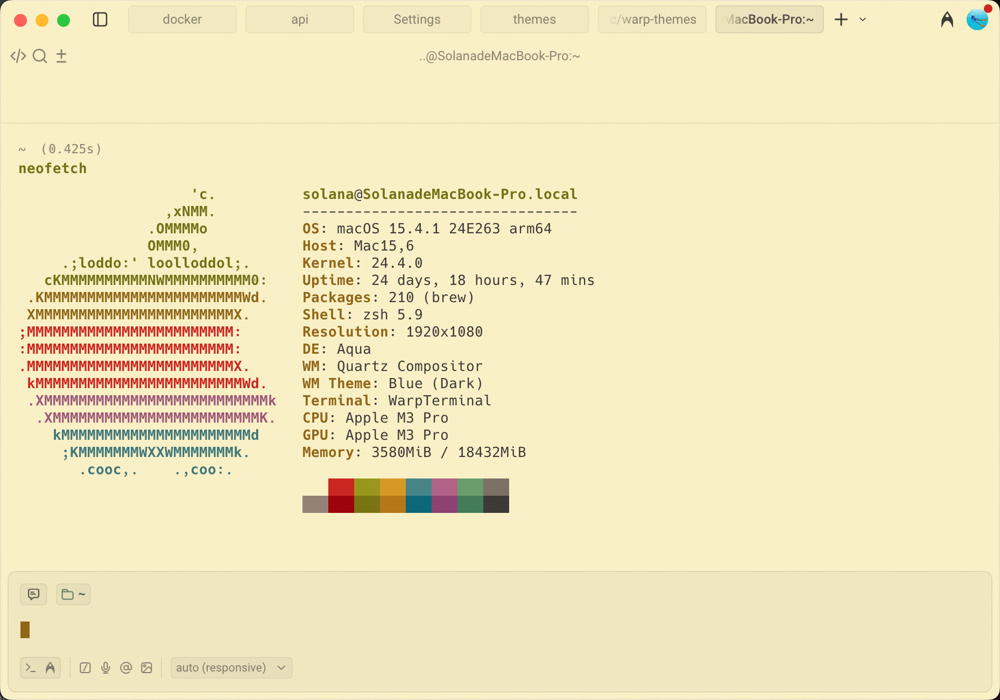
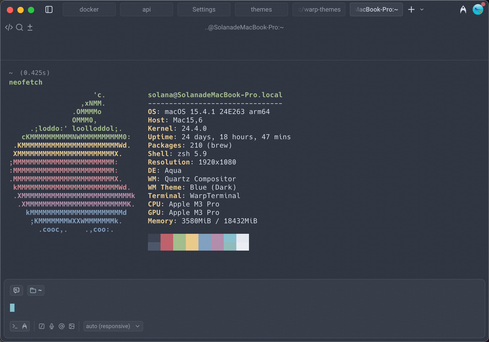
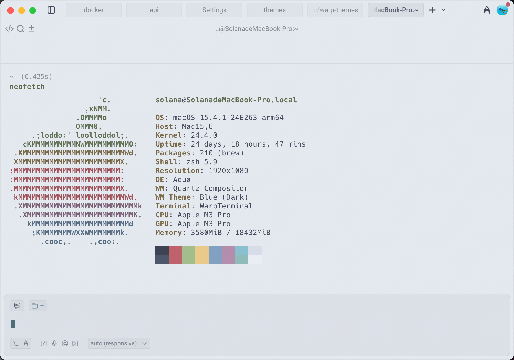
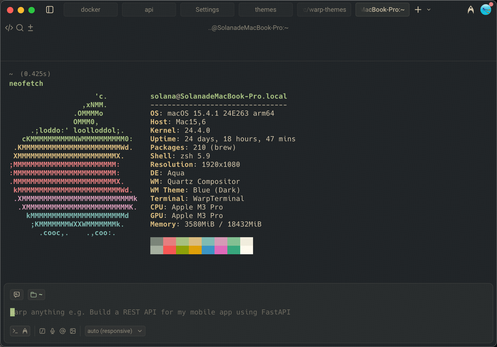

# Warp Themes

A collection of beautiful color themes for [Warp Terminal](https://www.warp.dev/).

## Available Themes

### Ubuntu

A classic Ubuntu-inspired theme with warm purple background and vibrant accent colors.



### Gruvbox Dark

A retro groove color scheme with warm, earthy tones and comfortable contrast.



### Gruvbox Light

Gruvbox light variant with warm cream background, perfect for daytime coding.



### Nord

An arctic, north-bluish color palette with calm and serene aesthetics.



### Nord Light

Nord light variant with soft bluish-white background for a clean, minimal look.



### Everforest Dark Hard

A green-based color scheme designed to be warm and comfortable for your eyes.



---

## Installation

Copy the theme file(s) to your Warp themes directory:

```bash
cp *.yaml ~/.warp/themes/
```

Then select the theme in Warp: `Settings` → `Appearance` → `Theme`

## Custom Theme Guide

For more information on creating custom themes, see the [Warp documentation](https://docs.warp.dev/terminal/appearance/custom-themes#create-your-custom-theme-manually).
